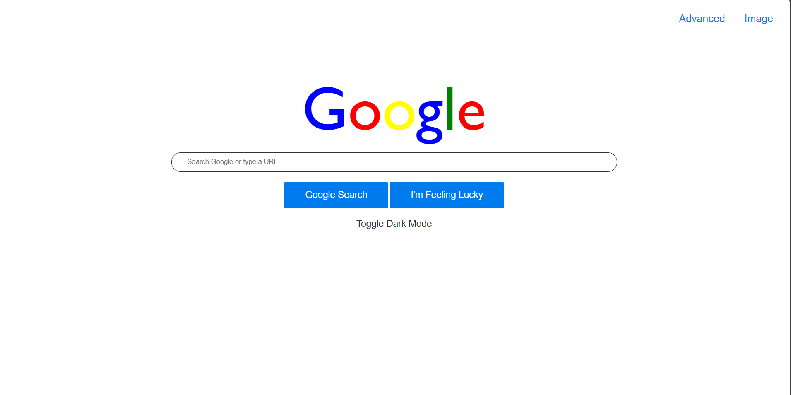
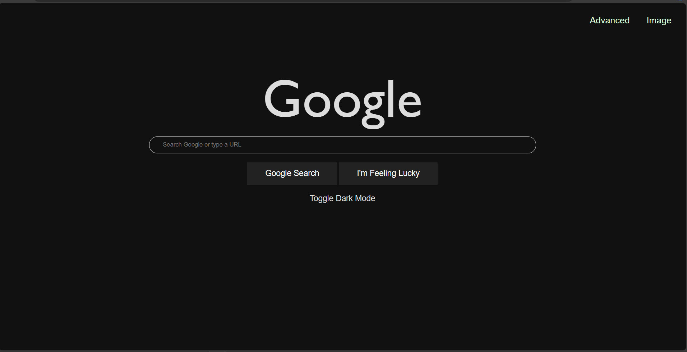
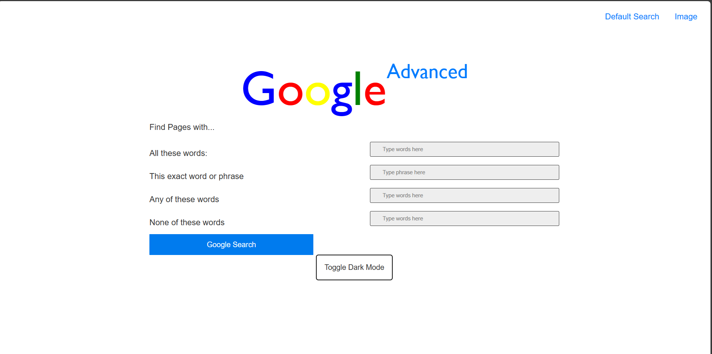
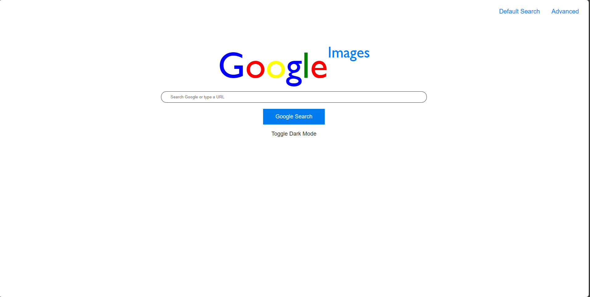
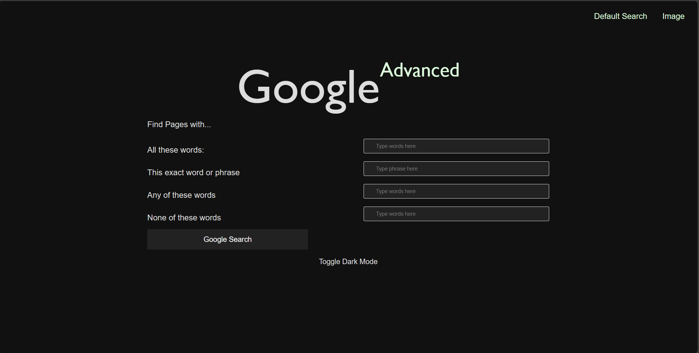
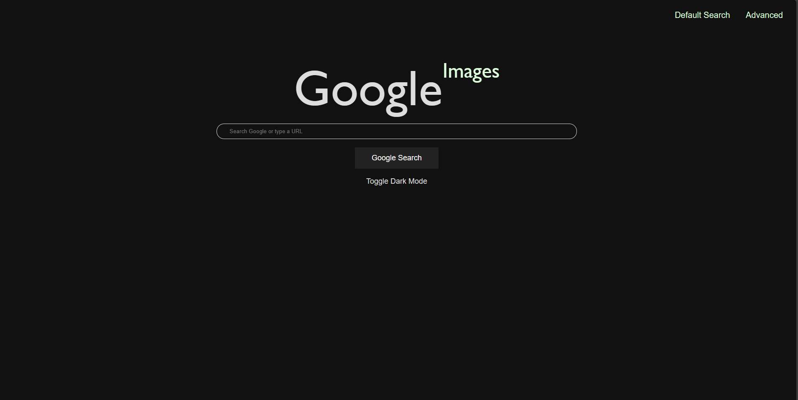

# Google Search Page - Project 0  
Contains three pages, one for regular Google Search `index.html`,
one for Google Image search `search-image.html`, and one for Google Advanceed Search `earch-advanced.html`

The pages are functional for search, using an input form to append a search query to https://www.google.com/search and retrieve the resulting page.

### Default Search Page
 

### Advanced Search Page

### Images Search Page

